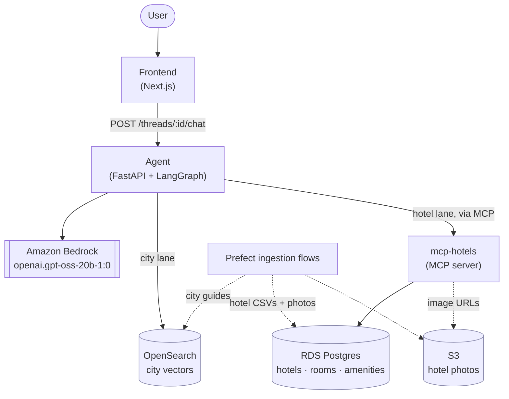
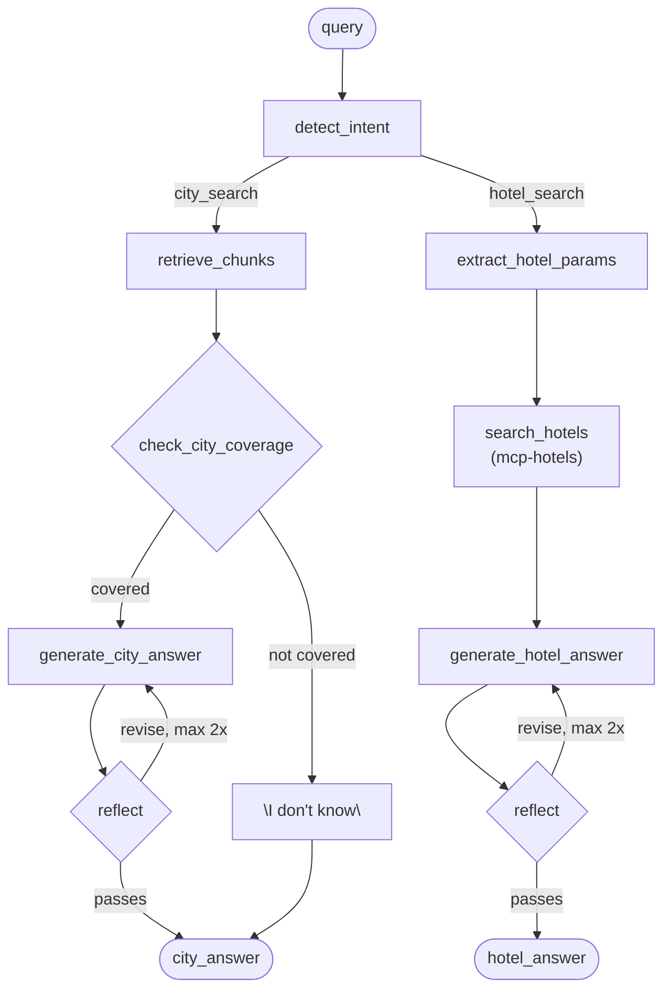
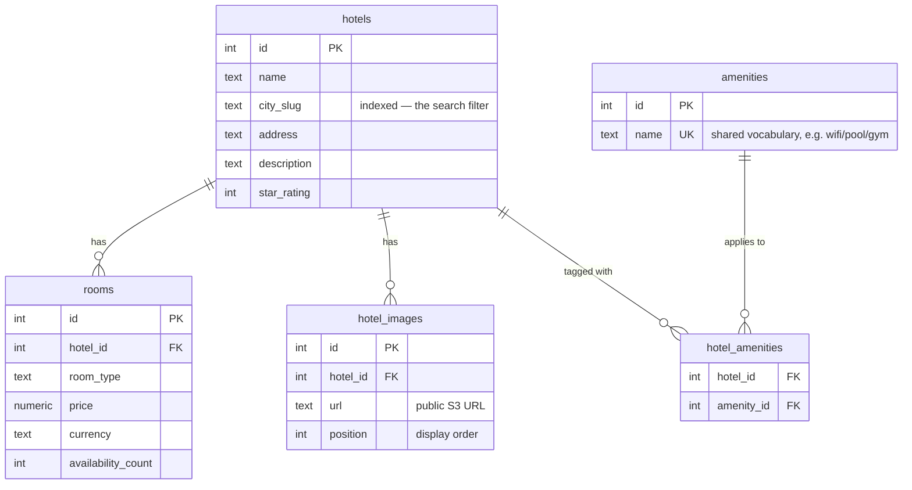

# Travel Assistant


An agentic travel assistant that answers questions about cities and searches for hotels — deployed on AWS with a full CI/CD pipeline.

## Overview

The assistant handles two kinds of requests, either alone or combined in a single query ("what is Paris and find me hotels there"):

- **City info** — retrieval-augmented answers grounded in a curated set of city guides, indexed in OpenSearch. A dedicated coverage check runs before generation, so an unindexed city gets an honest "I don't know" instead of a hallucinated or loosely-related answer.
- **Hotel search** — structured parameter extraction (city, max price, star rating, amenities) followed by a call to a dedicated MCP server, which runs fully parameterized SQL against Postgres.

A LangGraph agent detects intent up front and routes to one or both fully independent lanes — there's no single shared "generate" step and no autonomous tool-calling loop deciding what to do next. Each lane ends in a bounded reflect-and-revise pass (draft → self-critique → at most one revision) before returning.

## Architecture

Three views, from the outside in: how the deployed services talk to each other, how a single request moves through the agent's decision logic, and how hotel data is actually shaped in Postgres.

### System

The frontend only ever talks to the agent. The agent is the sole caller of both the LLM and every data store — it queries OpenSearch directly for city content, but reaches Postgres only indirectly, through `mcp-hotels`, which is the one service allowed to hold a database connection. A separate, offline set of Prefect flows is what populates OpenSearch and Postgres/S3 in the first place; nothing in the request path writes to them.



`mcp-hotels` runs as an internal-only ECS Fargate service (no public ALB), reachable only from the agent via AWS Cloud Map — everything else above is a normal public-ALB Fargate service behind its own security group.

### Agent decision flow

Inside the agent, `detect_intent` is the only place an LLM decides *what to do* — everything downstream of it is a fixed, deterministic path per lane, not an autonomous agent loop re-deciding at each step. A query can set `city_search`, `hotel_search`, or both, and both lanes run independently when triggered. Each lane ends the same way: draft an answer, have the model critique its own draft, and revise at most twice before returning.



`check_city_coverage` runs *before* any answer is drafted, deliberately: an earlier design reflected on the answer *after* generation instead, and it reliably failed to catch a city that was merely mentioned in passing in another city's article (e.g. Sydney showing up inside Canberra's page) rather than actually covered by it — the model kept rationalizing around its own draft. Deciding coverage from the raw sources, before any prose exists to defend, proved far more reliable.

### Hotel data model

`mcp-hotels` is the only service with a Postgres connection, and the schema it queries is intentionally normalized rather than free-text: amenities are a shared, fixed vocabulary (so "wifi" filters correctly regardless of which hotel wrote it), and rooms/images are separate one-to-many tables rather than columns crammed onto `hotels`. IDs are plain integers assigned by the CSV seed data, not database sequences.



## Technology stack

**Frontend** — Next.js 16, React 19, TypeScript, Tailwind CSS 4, Vitest + Testing Library, pnpm.

**Agent** (`agent/`) — Python 3.13, FastAPI, LangGraph, LangChain (community + AWS), FastEmbed (`BAAI/bge-small-en-v1.5`, run locally), `opensearch-py`, the `mcp` SDK (Streamable HTTP client), boto3.

**mcp-hotels** (`mcp-hotels/`) — Python 3.12, the `mcp` SDK (server), SQLAlchemy Core (parameterized queries, no ORM, no raw SQL), psycopg3, boto3.

**Ingestion** (`pipelines-prefect/`) — Prefect 3, LangChain text splitters, FastEmbed, `opensearch-py`, psycopg3, boto3.

**LLM** — Amazon Bedrock, `openai.gpt-oss-20b-1:0` (cheapest on-demand text model in the deployed account/region — a deliberate choice for a demo project), invoked via each ECS task's own IAM role (no API keys). Embeddings run locally via FastEmbed, not through Bedrock.

**Infrastructure** — Terraform (AWS provider), provisioning a VPC, an ECS Fargate cluster (agent, frontend, mcp-hotels), RDS Postgres, OpenSearch, S3, Cloud Map (private DNS service discovery), and OIDC federation for GitHub Actions. State lives in S3 with DynamoDB locking.

**CI/CD** — GitHub Actions: test → build → push to Docker Hub → `terraform apply`, triggered on merge to `main`.

**Local dev** — docker-compose, switching between local and AWS-backed config via `--env-file .env` / `--env-file .env.prod` (same images, same code, different backends).

## Folder structure

```
travel-assistant/
├── agent/                   FastAPI + LangGraph backend
│   ├── src/
│   │   ├── graph/
│   │   │   ├── nodes/       city.py, hotel.py, shared.py, schemas.py, structured_output.py
│   │   │   ├── graph.py     StateGraph wiring (intent → lanes → reflect loops)
│   │   │   ├── mcp_client.py  calls mcp-hotels over MCP/Streamable HTTP
│   │   │   └── config.py, state.py
│   │   └── routes/          health.py, threads.py
│   ├── prompts/              YAML prompt templates, one per node
│   └── tests/
├── frontend/                 Next.js chat UI
│   └── src/
│       ├── app/               pages + api/chat/route.ts (server-side proxy to the agent)
│       ├── components/        ChatLayout, MessageList, HotelCard, HotelResults, ...
│       └── lib/                chatClient.ts, backendClient.ts, chat.ts
├── mcp-hotels/                MCP server: search_hotels tool over Postgres
│   └── src/                   config.py, db.py (SQLAlchemy Core queries), server.py
├── pipelines-prefect/         Ingestion flows
│   └── flows/                 cities_ingest_flow.py, hotels_ingest_flow.py, hotels_schema.sql
├── data/                      Seed data ingested by the flows above
│   ├── hotels/                 hotels/rooms/amenities CSVs + hotel photos
│   └── text/                   city guides (markdown), one per city
├── evaluation/                RAGAS-based evaluation harness (not yet wired into CI)
├── infra/
│   ├── terraform/              main stack: vpc, ecs cluster, agent/frontend/mcp-hotels
│   │                            services, postgres, opensearch, s3, service discovery,
│   │                            github OIDC — modules/fargate/ is the reusable
│   │                            ECS-service module (ALB or internal-only)
│   └── terraform-bootstrap/    one-time, manually-applied: pushes GitHub Actions
│                                repo secrets from the main stack's outputs
├── docker-compose.yml         local (or AWS-backed) multi-service dev environment
├── .env / .env.prod           local-dev vs AWS-backed config for docker-compose
└── .github/workflows/deploy.yml
```

## Features

- [x] Multi-label intent detection — a query can trigger the city lane, the hotel lane, or both
- [x] RAG-grounded city Q&A over a curated city-guide knowledge base (OpenSearch)
- [x] Pre-generation coverage check — an unindexed city gets an honest "I don't know," not a hallucination
- [x] Hotel search by city, max price, minimum stars, and amenities, via a dedicated MCP server
- [x] Fully parameterized SQL (SQLAlchemy Core) — no raw or string-interpolated queries
- [x] Bounded reflect-and-revise quality loop per lane (draft → self-critique → up to one revision)
- [x] Model-agnostic structured output — YAML-based parsing with regex fallback and one corrective retry, not dependent on a specific model's native structured-output/tool-calling support
- [x] Harmony-format-aware response parsing, so reasoning-model chain-of-thought never leaks into a user-facing answer
- [x] Real hotel data — real hotels, real addresses, real photos, seeded via a Prefect ingestion flow
- [x] Chat UI with hotel result cards, per-lane intent labels, and a wrapping results layout
- [x] Full AWS deployment (ECS Fargate, RDS, OpenSearch, S3, Cloud Map) provisioned via Terraform
- [x] CI/CD: test, build, and deploy automatically on merge to `main`
- [x] Local/prod parity — same docker-compose stack, switched via env file
- [ ] Persist conversation state across requests (no checkpointer attached yet — `thread_id` is accepted but doesn't carry history between calls)
- [ ] Reorganize frontend components into `chat/` / `hotels/` subfolders
- [ ] Wire the RAGAS evaluation harness (`evaluation/`) into CI
- [ ] Hotel booking / reservation flow (search-only today)
